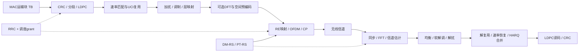

# 5G NR 物理层教程：从调度到 PUSCH 接收

阅读入口：[总目录](README.md) · [术语与公式](核心术语与公式.md) · [例程](例程手册.md) · [标准索引](参考资料与标准索引.md)

## 1. 用一个数据包理解五份规范

设 UE 需要上传一个数据包。MAC 准备运输块，基站分配发送资源，UE 进行编码、调制并发送，基站估计信道并恢复比特。理解这一过程，比按编号连续读五份规范更有效。

| 规范 | 回答的问题 | 本教程重点 |
|---|---|---|
| 38.211，Physical channels and modulation | 复数符号如何产生，放在哪些时频位置？ | PUSCH 调制、层映射、变换/空间预编码，DM-RS/PT-RS、OFDM |
| 38.212，Multiplexing and channel coding | TB 如何变成有纠错能力的编码比特？ | CRC、LDPC、分段、速率匹配、UCI 复用、DCI 字段 |
| 38.213，Physical layer procedures for control | 何时发、发多大功率、怎样处理控制信息？ | 上行功控、TA、控制信息处理、随机接入相关过程 |
| 38.214，Physical layer procedures for data | 用哪些资源、多少层、何种调制、装多少数据？ | PUSCH 调度、MCS/TBS、SRS/预编码、准备时间 |
| 38.215，Physical layer measurements | 测量值究竟是什么、如何定义？ | RSRP/RSRQ/SINR、基站测量及测量口径 |

它们通过参数互相连接；38.215 并不是发送链上插入的一道串行处理工序。RRC 参数的信令定义还要查 38.331，MAC HARQ 状态还要查 38.321。五份规范的固定版本及条款入口见[标准索引](参考资料与标准索引.md)。



这里的接收机是工程框架。标准主要约定双方必须一致的信号和过程；通常不会规定接收机只能使用某一种 LS 插值器、均衡器或 LDPC 迭代算法。

## 2. 先建立时频坐标

### 2.1 Numerology、帧和时隙

子载波间隔为 Δf = 15×2^μ kHz。本文普通 CP 下，每时隙 14 个 OFDM 符号，每子帧 1 ms，每帧 10 ms，每子帧有 2^μ 个时隙。下表列的是入门常见数值，不是全部 Release 18 numerology 清单。

| μ | SCS | 时隙时长 | 每帧时隙数 | 不含 CP 的符号时长 1/Δf |
|---|---:|---:|---:|---:|
| 0 | 15 kHz | 1 ms | 10 | 66.667 μs |
| 1 | 30 kHz | 0.5 ms | 20 | 33.333 μs |
| 2 | 60 kHz | 0.25 ms | 40 | 16.667 μs |
| 3 | 120 kHz | 0.125 ms | 80 | 8.333 μs |

CP 不是所有符号都一样长；60 kHz 还有扩展 CP 配置，不能把“14 个符号”用于所有情形。SCS 也不等于采样率；实现中采样率取决于 FFT 点数，理想关系为 Fs=NFFT·Δf。[38.211 §4、§5.3](https://www.etsi.org/deliver/etsi_ts/138200_138299/138211/18.05.00_60/ts_138211v180500p.pdf)

### 2.2 RE、RB、BWP 的关系

RE 是一个子载波与一个 OFDM 符号的交点。一个 RB 在频率方向包含 12 个连续子载波；时间长度由分配决定，不应把 RB 定义成固定 1 ms。一个普通 CP 时隙中的一个 RB 有 12×14=168 个 RE，但并非全用于数据。

BWP 是供 UE 使用的一段带宽配置，包含起点、大小和 numerology。PRB 通常在 BWP 内编号，CRB 使用对应 numerology 的公共资源块坐标，参考 Point A。若 BWP 起点为 CRB 24，本地 PRB 10 对应 CRB 34；这不是 FFT 数组下标，转到实现数组还要考虑载波网格起点与频移。

主例分配 20 PRB，资源占宽为 20×12×30 kHz=7.2 MHz。这是所分配子载波宽度，不是含保护带的信道带宽，也不能据此推断整载波的标准带宽。

### 2.3 其他 NR 信道为何与 PUSCH 有关

| 对象 | 作用 | 与 PUSCH 的关系 |
|---|---|---|
| PSS/SSS、PBCH/SSB | 初始同步、小区识别、广播基础信息 | 先获得可接入小区与时频参考 |
| PDCCH | 承载 DCI | 动态上行 grant 经它传给 UE |
| PDSCH | 下行共享数据 | UE 对下行数据的 HARQ-ACK 可复用到 PUSCH |
| PRACH | 发起随机接入 | 后续 Msg3 或两步接入相关数据涉及 PUSCH |
| PUCCH | 上行控制 | 与 PUSCH 的 UCI 复用/碰撞处理相连 |
| SRS | 上行探测 | 帮助基站选择资源、层数和预编码 |
| DM-RS | 本次传输的解调参考 | 接收端据它估计等效信道 |
| PT-RS | 相位跟踪 | 主要帮助估计公共相位误差 |

这些角色可通过 [38.211 的物理信道与参考信号章节](https://www.etsi.org/deliver/etsi_ts/138200_138299/138211/18.05.00_60/ts_138211v180500p.pdf)查阅。先记住角色，再学习序列构造。

## 3. 从调度信息生成一次 PUSCH

### 3.1 配置与本次 grant 要合起来看

RRC 配置提供可用的 BWP、时域分配表、DM-RS、MCS 表与发送方式等背景；本次 DCI 再选择资源、MCS、RV、HARQ process、NDI 等。只打印一个 MCS 索引，通常不足以复现一次传输。

DCI 0_0 是常见的回退格式；0_1 支持更丰富的上行调度；0_2 等属于后续增强。字段是否存在、占多少位，取决于格式与配置。不要给所有 DCI 套一个固定结构体布局。字段定义看 [38.212 §7.3.1.1](https://www.etsi.org/deliver/etsi_ts/138200_138299/138212/18.05.00_60/ts_138212v180500p.pdf)，字段含义如何落到资源看 [38.214 §6.1](https://www.etsi.org/deliver/etsi_ts/138200_138299/138214/18.05.00_60/ts_138214v180500p.pdf)。

动态 grant 按次指示传输。Configured Grant Type 1 主要由 RRC 配置资源；Type 2 还涉及 DCI 激活/去激活。它们减少逐次调度开销，但不会取消编码、DM-RS 或 HARQ 的约束。

### 3.2 时间分配：K2、S、L、SLIV

K2 关联上行 grant 与 PUSCH 的时隙位置；S 是起始符号，L 是分配的符号数。时域字段通常选中一条时域资源分配记录，不能直接把字段数值当 K2。

同 SCS 的简单例子：slot 4 收到 grant，K2=2，则目标为 slot 6。仍要确认其符号是可用上行符号，并满足 UE 的 PUSCH 准备时间。跨 numerology 不能直接照搬这个加法。

普通 CP 的 SLIV 紧凑表达 S 和 L：当 L−1≤7，SLIV=14(L−1)+S；否则 SLIV=14(15−L)+(13−S)。S=2、L=12 时，SLIV=53。能编码不代表一定符合 Mapping Type 或 TDD 规则。[38.214 §6.1.2.1、§6.4](https://www.etsi.org/deliver/etsi_ts/138200_138299/138214/18.05.00_60/ts_138214v180500p.pdf)

### 3.3 频率分配：连续区域与资源块组

常见 Type 0 使用 RBG 位图，可表达一组资源块组；Type 1 用 RIV 紧凑表达连续 RB 区间。N 为相关分配带宽大小，起点 S_RB、长度 L_RB：

```text
若 L_RB - 1 <= floor(N/2): RIV = N*(L_RB-1) + S_RB
否则:                    RIV = N*(N-L_RB+1) + (N-1-S_RB)
```

N=52、S_RB=10、L_RB=20 时，RIV=998。例程穷举所有合法区间检查编码是否一一对应。实际 DCI 解码还要使用其规定的参考带宽、字段宽度及跳频解释，不能仅凭这个函数完成。[38.214 §6.1.2.2](https://www.etsi.org/deliver/etsi_ts/138200_138299/138214/18.05.00_60/ts_138214v180500p.pdf)

建议把完整配置写入不可变的 grant 对象，然后由同一对象生成发送端和接收端所需参数，避免两边各自推断默认值。

## 4. 主实例：资源如何变成 4992 bit 的 TB

### 4.1 已知条件

| 参数 | 数值 | 说明 |
|---|---|---|
| μ / CP | 1 / normal | 30 kHz，0.5 ms 时隙 |
| PRB 数 | 20 | 无跳频 |
| S、L | 2、12 | 包括符号 2 和 13 |
| 层数 ν | 1 | 单码字 |
| transform precoding | disabled | CP-OFDM |
| DM-RS | Type A，l0=2，additionalPosition=pos1，len1 | 无跳频，分配终点为时隙末尾，位置 2、11 |
| DM-RS 配置/端口 | type 1，port 0 | 一个 CDM group without data |
| MCS | 适用表 5.1.3.1-1 的索引 12 | Qm=4，R=490/1024 |
| 其他 | 无 UCI/PT-RS；xOverhead=0 | 单时隙普通传输 |

这里明确选定了 MCS 表分支；不能把索引 12 在其他表中的解释也写死为 16QAM。PUSCH 在满足条件时引用名称为 PDSCH 的公共 MCS 表，这是规范的交叉引用，不是误用下行规则。[38.214 §6.1.4.1](https://www.etsi.org/deliver/etsi_ts/138200_138299/138214/18.05.00_60/ts_138214v180500p.pdf)

### 4.2 先算 RE，再区分三个比特长度

每 PRB 共 12×12=144 RE。两个 DM-RS 符号，每符号每 PRB 保留 6 RE，故扣除 12 RE；剩 132 RE。全分配为 132×20=2640 个数据 RE。

```text
N_RE,TBS = min(156, 12*L - N_DMRS - N_oh) * N_PRB = 2640
N_info   = N_RE,TBS * Qm * R * ν = 5053.125
G        = N_RE,actual * Qm * ν  = 10560  （本例无UCI等）
```

N_info 是中间估计值，G 是供调制的编码比特容量，A=TBS 才是运输块大小。三者含义不同。规范 TBS 确定入口是 [38.214 §6.1.4.2](https://www.etsi.org/deliver/etsi_ts/138200_138299/138214/18.05.00_60/ts_138214v180500p.pdf)，其普通分支引用 §5.1.3.2 的量化步骤；也可参看 [nrTBS 参数解释](https://www.mathworks.com/help/5g/ref/nrtbs.html)。

### 4.3 TBS 量化手算

N_info>3824，进入大块分支：

```text
n = floor(log2(N_info - 24)) - 5 = 7
N_info' = max(3840, 2^n * round((N_info - 24)/2^n)) = 4992
```

此处 R>1/4，N_info'≤8424，因此 TBS=8·ceil((4992+24)/8)−24=4992 bit，即 624 byte。round 的半整数向上取整；C++ 例程对正数显式使用 floor(x+0.5)，避免移植时混入其他舍入约定。

小块例子：4 PRB、同样每 PRB 132 RE、QPSK、R=120/1024，得到 N_info=123.75。小块分支取 n=3、量化为 120，再找不小于它的最小合法 TBS，结果也是 120 bit。例程 2 同时实现大小两个分支。

### 4.4 为什么不能把 RE 上限带进实际映射

另取 14 个符号、每 PRB 只有 6 个 DM-RS RE，实际剩 162 RE。TBS 计算采用的上限为 156，实际调制却仍可使用符合映射规则的 162 RE。20 PRB、16QAM、单层时：TBS 口径 RE=3120，实际 RE=3240，G=12960。

xOverhead 是 TBS 计算的高层参数，不能自动当成一张实际 RE 排除掩码。PT-RS、UCI 以及其他保留资源必须按各自规则确定。工程中建议分别命名 `n_re_for_tbs` 与 `n_re_for_mapping`。

### 4.5 速率的正确解释

本例 A/G≈0.4727，包含 TB CRC 的 (A+24)/G=0.475，与 MCS 目标 R≈0.4785 不完全相同，这是 TBS 量化等因素所致。

理想连续新传输速率为 4992/0.0005=9.984 Mbit/s。如果只有一半时隙可用于这种上行分配，先降为 4.992 Mbit/s；重传、空调度和 MAC/RLC/IP 开销还会继续改变实际吞吐。统计时应累计成功交付的**不重复新 TB**。

## 5. 38.212：从 TB 到编码比特

### 5.1 CRC、基图、分段各自解决什么问题

CRC 用于检错，LDPC 用于纠错。运输块过大时先分为多个码块，便于有限尺寸的编码器与并行译码器处理。TB CRC 判断整个运输块是否正确；分段后的 CB CRC 帮助识别码块错误。

普通 UL-SCH：A≤3824 时 TB 附 CRC16，否则附 CRC24A。BG2 的选择条件为 A≤292，或 A≤3824 且 R≤0.67，或 R≤0.25；其他情况选 BG1。对应最大 CB 尺寸为 BG1 的 8448 与 BG2 的 3840。多 CB 时每块附 CRC24B。[38.212 §6.2.1–6.2.4、§5.2.2](https://www.etsi.org/deliver/etsi_ts/138200_138299/138212/18.05.00_60/ts_138212v180500p.pdf)

### 5.2 主例尺寸追踪

```text
A = 4992               运输块，不含TB CRC
B = A + 24 = 5016      加TB CRC后
BG = 1                 按A与目标R选择
C = 1                  不分段，因此不附CB CRC
K' = 5016              本码块实际输入比特数
Kb = 22                BG1选择lifting size的系数
Zc = 240               最小的合法值，满足22*Zc >= 5016
K = 5280               LDPC系统部分尺寸
F = K-K' = 264         filler数
N = 66*Zc = 15840      BG1去掉前2*Zc后的编码输出长度
G = 10560              本例单码块、无UCI的速率匹配输出长度
```

Zc 必须从标准允许的 lifting size 集合选择，不能任意取 ceil(K'/22)。Filler 在编码中作为已知值处理，在选择输出比特时按规则跳过，不是用户传输的数据。尺寸解释也可交叉查阅 [nrDLSCHInfo](https://www.mathworks.com/help/5g/ref/nrdlschinfo.html)；这里使用的是 DL-SCH/UL-SCH 共用的 LDPC 基础过程，UCI 另行处理。

BG2 的常见坑：用于选 Zc 的 Kb 会随 B 的大小取 6、8、9 或 10，但最终系统部分仍为 10Zc，不能写成 K=Kb·Zc。小例 A=120，B=136，Kb=6，Zc=24，K=240，filler=104。

### 5.3 LDPC 的原理

LDPC 用稀疏校验矩阵 H 定义合法码字：Hc=0（模 2）。接收机依据每比特的可信度，在变量节点与校验节点之间交换消息，逐步寻找满足校验约束的码字。NR 的 QC-LDPC 把基图中非零位置展开成移位单位矩阵，Zc 决定展开规模。

实现时，把“基图选择”“lifting 参数”“编码矩阵”“迭代译码”拆成不同模块。先用编码输出验证 Hc=0，再比较不同噪声下的译码结果；只有数组长度正确还不能证明编码器正确。

### 5.4 速率匹配为什么不只是截断

可用无线资源每次可能不同，LDPC 母码输出长度却由 BG 与 Zc 决定。速率匹配从循环缓冲选择比特，处理 filler、必要的重复和调制相关交织，使输出适合本次容量。

RV 影响读取起点，不是新的码率。多次发送可能携带同一母码的不同部分；接收端先将它们放回相同的母码位置再合并。不能把两个不同 RV 的接收向量按数组下标直接相加。[38.212 §5.4.2、§6.2.5](https://www.etsi.org/deliver/etsi_ts/138200_138299/138212/18.05.00_60/ts_138212v180500p.pdf)

### 5.5 UCI 复用

PUSCH 除 UL-SCH 外还可携带 HARQ-ACK、CSI 等控制信息。它们经过自己的编码和资源分配，再与数据组合。UCI 编码不能统一叫 LDPC：短控制信息和较长控制信息可能采用不同方式。

要区分：PUSCH 中复用的 HARQ-ACK 通常是 UE 对**下行**传输的反馈；基站对这次**上行** TB 的接收结果则属于另一条 HARQ 控制流程。UCI 较短时的占位、打孔等细节需要按 §6.2.7、§6.3.2 实现，不能简单在 UL-SCH 尾部追加比特。[38.212 UCI 过程](https://www.etsi.org/deliver/etsi_ts/138200_138299/138212/18.05.00_60/ts_138212v180500p.pdf)

## 6. 38.211：从比特到资源网格

### 6.1 加扰与调制

加扰将编码比特与确定性的伪随机序列异或，使不同发送上下文产生不同符号模式；它不是安全加密。发送端和接收端必须使用相同的初始化参数。

本教程限定的单码字普通 PUSCH 数据加扰采用 c_init=n_RNTI·2^15+n_ID。Gold 序列由两个 31 阶移位寄存器生成并跳过 Nc=1600 个位置。数据加扰 ID 与 DM-RS 序列 ID 应分别记录，即使例程恰好都取 42。[38.211 §5.2.1、§6.3.1.1](https://www.etsi.org/deliver/etsi_ts/138200_138299/138211/18.05.00_60/ts_138211v180500p.pdf)

单位能量 QPSK 映射为：

\[
s=\frac{(1-2b_0)+j(1-2b_1)}{\sqrt2}.
\]

16QAM 每符号 4 bit，64QAM 每符号 6 bit，256QAM 每符号 8 bit。更高阶星座在相同平均能量下点距更小，因此通常对噪声、相位误差和非线性更敏感。例程 3 为便于观察只运行 QPSK，主例 TBS 则使用 16QAM，二者不冒充同一完整链路。

### 6.2 层映射、DFT 与空间预编码

层是并行数据流；端口是描述参考信号和等效信道关系的逻辑对象；物理天线是硬件。一个层可以经多个天线发出，多根天线也不必对应同样多的独立层。

层映射安排数据到各层。可选的 transform precoding 在调制符号上做 DFT，形成 DFT-s-OFDM 结构。空间预编码再按矩阵 W 将层映射到端口/发射维度：x=W·s。这两个“预编码”解决不同问题。

Codebook-based 发送使用配置的码本和相应指示（如 TPMI）来选择空间映射；non-codebook-based 也会使用空间处理，通常结合 UE 生成的 SRS 资源与基站的选择完成发送决策，不能理解为 W 恒等于 I。[38.214 §6.1.1](https://www.etsi.org/deliver/etsi_ts/138200_138299/138214/18.05.00_60/ts_138214v180500p.pdf)

### 6.3 为什么有两种波形

CP-OFDM 将调制符号直接映射到子载波，再 IFFT、加 CP。DFT-s-OFDM 先做 DFT 扩展，再映射、IFFT、加 CP；一个原始符号的信息分布到多个子载波。它通常能降低包络波动，改善 UE 功放效率，但 PAPR 的差异取决于配置、调制和观测方式，不能保证每一条随机波形都更低。

例程 4 对 400 组同源 QPSK 数据做比较，使用 4 倍过采样估计 PAPR，并验证 DFT/IFFT 回环。它固定 CP=32，未实现 NR 的精确 CP 时序和参考信号布局。关于 PUSCH 波形与参考信号的关系可参看 [MathWorks 资源分配与参考信号示例](https://www.mathworks.com/help/5g/ug/nr-pusch-resource-allocation-and-dmrs-and-ptrs-reference-signals.html)。

## 7. DM-RS、PT-RS 与 SRS

### 7.1 三者回答三个问题

DM-RS 告诉接收机“本次数据经过的等效信道是什么”；PT-RS 帮助回答“相位随时间偏了多少”；SRS 帮助调度器和发送方案选择了解更广泛的上行信道。它们不能互相简单替代。

### 7.2 四组独立配置

| 配置 | 决定什么 | 常见误读 |
|---|---|---|
| Mapping Type A/B | 时间参考与前置 DM-RS 的位置关系 | 把它当频域 type 1/2 |
| DM-RS configuration type 1/2 | 频域图案与端口复用结构 | 把 type 2 当第二个 DM-RS 符号 |
| maxLength、实际 DM-RS 长度 | 单/双符号及允许选择 | 看到 maxLength=len2 就认为每次必发双符号 |
| additionalPosition | 允许的附加时间位置 | 无条件解释为“增加指定数量” |

Type A 的前置 DM-RS 使用时隙参考，l0 可为 2 或 3；这不是说 PUSCH 只能从符号 2/3 开始。Type B 的前置 DM-RS 与本次分配起点相关。实际图案还依赖分配长度、跳频、端口和 DCI。[38.211 §6.4.1.1](https://www.etsi.org/deliver/etsi_ts/138200_138299/138211/18.05.00_60/ts_138211v180500p.pdf)

### 7.3 主例的 DM-RS 图案

本例 type 1、port 0 在一个 DM-RS 符号内占每 PRB 的相对子载波 0、2、4、6、8、10。另 6 个 RE 是否可用于数据，由 CDM groups without data 等配置决定；本例只有一个组禁数据，因此它们仍可承载数据。不能按照“实际发送了几个端口”直接扣除 RE。

时域位置 2 和 11，来自单符号、无跳频、Type A、l0=2、pos1、分配结束在符号 13 的组合。实际端口复用还使用覆盖码；例程只取端口 0，所以不实现多端口解扩。图案解释入口为 [ShareTechnote PUSCH DMRS](https://www.sharetechnote.com/html/5G/5G_PUSCH_DMRS.html)，以标准对应表格为准。

CP-OFDM 基本 DM-RS 的初始化在普通 CP 下可写为：

\[
c_{init}=\left[2^{17}(14n_s+l+1)(2N_{ID}^{n_{SCID}}+1)+2N_{ID}^{n_{SCID}}+n_{SCID}\right]\bmod 2^{31}.
\]

n_s 为帧内时隙编号，l 为时隙内符号编号。例程固定 n_s=0、序列参考起点 CRB 0；搬到其他 PRB 时须同时处理序列偏移，不能每个 PRB 都从序列头开始。开启 transform precoding 时还涉及低 PAPR 序列体系，不能直接复用本例函数。

### 7.4 DM-RS 开销与性能的交换

增加 DM-RS 时间密度可能改善快速时变信道估计，但留给数据的 RE 更少。增加 DM-RS 不是无条件提高吞吐率。设计对比实验时，应同时报告估计误差、BLER 和实际成功交付速率。

PT-RS 主要跟踪公共相位误差；强相位噪声造成的 ICI 不会因为估计了一个公共旋转角就全部消失。[参考信号示例说明](https://www.mathworks.com/help/5g/ug/nr-pusch-resource-allocation-and-dmrs-and-ptrs-reference-signals.html)

## 8. 基站接收机：怎样恢复比特

### 8.1 同步与 FFT

接收机先处理定时、频偏和采样偏差，再选择 FFT 窗并去 CP。足够长的 CP 可在合适窗口内将有限多径卷积转为子载波上的乘法。CP 不足或 FFT 窗偏差过大会破坏这一近似。

可复习本项目第三部分的多径、定时与 CFO 例程。新增 NR 开发时，要把它们接到真实 DM-RS 和精确符号边界上，而不是直接沿用教学前导。

### 8.2 信道估计

单端口导频满足 Yp=Hp·Xp+Np。LS 估计为 Hhat=Yp/Xp。估计以后还要去除端口覆盖码影响，并在时频上平滑、插值到数据位置。平坦、静态信道可以把多个导频的估计平均；频率选择性或时变信道下，全局平均会丢掉真实变化。

例程 5 特意限定 H=0.7+0.4j，并平均 120 个 DM-RS 样本。因此它展示的是 LS 的最小可运行版本，不能据此宣称已实现真实 PUSCH 信道估计器。

### 8.3 ZF、MMSE 与噪声口径

若 y=H·s+n、每层 Es=1、n 的协方差为 σ²I，则：

\[
W_{ZF}=(H^HH)^{-1}H^H,\qquad
W_{MMSE}=(H^HH+\sigma^2I)^{-1}H^H.
\]

ZF 力图消除流间干扰，但弱奇异值会放大噪声；MMSE 通过正则项折中干扰与噪声。实际代码宜解线性方程而不是显式求逆。若层功率不是 1、噪声有色或预编码改变归一化，需要调整模型。

DM-RS 通常估计的是与数据一致的等效信道，例如 H物理·W发送。若把估出的等效信道再错误地乘一次发送预编码，会重复处理。

### 8.4 软解调与 LLR

采用 LLR=ln[P(b=0|y)/P(b=1|y)] 时，正值偏向 0，负值偏向 1。max-log 近似可用“最近 bit=1 星座点距离平方减最近 bit=0 星座点距离平方”，再除以相应复噪声方差。均衡后的噪声增强必须计入可信度。

解扰在软域可用符号翻转：扰码位为 1 时 LLR 取反。硬判决仍能画 BER，但会丢掉 LDPC/HARQ 所需的置信度。判决对了不意味着 LLR 标度也对；错误标度可能在多轮合并时才暴露。

## 9. HARQ：保存的究竟是什么

HARQ 将前向纠错与重传结合。以每个进程为单位保存 TB 上下文、NDI、尺寸和软缓冲；相同 TB 重传要保留既有信息，判定为新 TB 时需要重置相关状态。实际新传/重传判断还受 MAC 状态和调度类型约束，不能脱离上下文只看 NDI 的绝对值。

```text
一次接收 → 解扰/解UCI复用 → 速率恢复到母码坐标
                                  ↓
                    合并该HARQ进程的历史LLR
                                  ↓
                           LDPC译码 → CRC
                         成功：交付；失败：等待后续处理
```

最简单的同位置独立观测可用 L_total=L1+L2。NR 的不同 RV 先要对齐到母码坐标；被打孔、重复、filler 位置的初始化与累加不同。[38.212 速率匹配](https://www.etsi.org/deliver/etsi_ts/138200_138299/138212/18.05.00_60/ts_138212v180500p.pdf)与[38.321 MAC 规范入口](https://www.3gpp.org/dynareport/38321.htm)分别负责相关的比特过程与状态过程。

例程 6 用两次独立噪声下的同一 BPSK 符号演示 LLR 合并。这是 Chase combining 原理实验，没有 RV、LDPC、CRC 或 HARQ 调度器。两次发送的总能量也增加了，不能把得到的改善称为“同总能量下免费获得的编码增益”。

BLER 是失败 TB 数占总 TB 数；BER 是错误比特数占总比特数。评估 HARQ 时应分别报告首传 BLER、最终丢块率、平均发送次数和新数据 goodput。

## 10. 38.213：功控、时序与控制约束

### 10.1 一条简化但有单位的功控公式

对单载波、单功控状态且忽略同时发射功率分配等附加条件，可理解为：

\[
P_{PUSCH}=\min\{P_{CMAX},P_0+10\log_{10}(2^\mu M_{RB})+\alpha PL+\Delta_{TF}+f\}\quad\mathrm{dBm}.
\]

P0 是开环目标相关项，PL 是以 dB 表示的路径损耗，α 是分数路径损耗补偿系数，ΔTF 是传输格式相关调整，f 是闭环 TPC 状态。完整规范还区分服务小区、BWP、参考信号与控制状态等索引。[38.213 §7.1.1](https://www.etsi.org/deliver/etsi_ts/138200_138299/138213/18.05.00_60/ts_138213v180500p.pdf)

例程取 μ=1、P0=−80 dBm、α=0.8、PL=100 dB、ΔTF=f=0、PCMAX=23 dBm。20 PRB 时请求约 16.02 dBm；160 PRB 时请求约 25.05 dBm，但只能发 23 dBm。资源继续增多而总功率受限，每单位带宽功率就下降，可能需要更低 MCS 才能保持可靠性。

这解释了“分配更多 PRB 却未必更快”：资源容量增大与信号质量下降可能同时发生。实际调度要结合功率余量、信道和 UE 能力判断，而不是只最大化 PRB 数。

### 10.2 TA 与 K2 的差别

K2 处理调度到数据传输的时间关系；TA 处理传播时延造成的到达时间偏差，使多个 UE 的上行波形更好地对齐基站接收窗口。TA 不是用来随意改变调度到哪一个时隙。

此外，PUCCH/PUSCH 碰撞、UCI 优先级、TDD 可用符号与 UE 准备时间都会影响“有 grant 是否就能按设想发送”。排障时应先验证资源合法性，再怀疑解调算法。[38.213 §4.2、§9](https://www.etsi.org/deliver/etsi_ts/138200_138299/138213/18.05.00_60/ts_138213v180500p.pdf)

## 11. 38.215：测量值如何支持 PUSCH 排障

38.215 定义标准测量量。SS-RSRP、CSI-RSRP 区分参考信号来源；RSRQ 把参考功率与带宽内总接收功率联系起来；SINR 比较期望信号与干扰噪声。基站测量还包括接收干扰功率、SRS 相关功率与时间测量。[38.215 §5.1、§5.2](https://www.etsi.org/deliver/etsi_ts/138200_138299/138215/18.04.00_60/ts_138215v180400p.pdf)

### 11.1 先定义测量集合，再算平均

若一组 RE 功率为 Pi，线性平均应先计算 mean(Pi)，再转 dB。−80 与 −100 dBm 对应功率平均后约 −82.97 dBm；直接平均 dBm 得 −90 dBm，意义不同。

RSRQ 的常见结构为 N·RSRP/RSSI。例程假设测量集合与 N 完全匹配，取 N=50、RSRP=−95 dBm、RSSI=−65 dBm，算得 −13.01 dB。实际实现必须使用对应 SS/CSI 版本定义的参考 RE、符号集合和测量带宽，不能任意混搭。

### 11.2 PHY 仿真指标与标准测量量分开命名

| 指标 | 适合回答的问题 | 不能据此直接推断 |
|---|---|---|
| SS/CSI-RSRP | 特定下行参考信号接收强度 | 上行 PUSCH 的解码一定可靠 |
| SRS 相关测量 | 上行探测资源上的信道/功率情况 | 与本次 PUSCH 完全相同的瞬时信道 |
| PUSCH post-equalization SINR | 接收算法输出质量 | 它天然就是 38.215 的某个同名测量量 |
| EVM | 估计符号相对参考星座的误差 | 已达到某项 RF 一致性测试要求 |
| BER、BLER、goodput | 比特、块和有效交付性能 | 三者可以互相直接替换 |

本教程 EVM 定义为 sqrt(Σ|s_hat−s|²/Σ|s|²)，仅用于数值实验。RF 一致性中的测量条件与限值需另查相应 38.101/38.104/38.521 等规范，38.215 不是全部射频指标的总表。

## 12. 工程排障、扩展与结业任务

### 12.1 按数据边界排障

| 现象 | 优先检查 | 最小验证方法 |
|---|---|---|
| 无噪声仍全错 | grant、RNTI、ID、映射索引、FFT归一化 | 逐阶段保存长度与少量样本 |
| DM-RS 相关性很低 | slot/symbol编号、nSCID、序列偏移、端口/OCC | 本地重建导频并逐RE比较 |
| DM-RS 正常但数据全错 | 调制顺序、层映射、数据加扰、均衡信道口径 | 单层QPSK理想信道起步 |
| 星座好看但CRC错 | TBS、BG/Zc、RV、filler、交织、LLR符号 | 独立比特级已知向量 |
| 单层好，多层差 | rank、预编码归一化、DM-RS端口解扩、噪声增强 | 固定已知MIMO矩阵，先无噪声 |
| 首传好，重传反而差 | HARQ进程错配、NDI状态、RV恢复、旧缓冲未清 | 每进程独立日志与母码索引 |
| 多PRB反而差 | PCMAX饱和、频率选择性、估计不足 | 联合画PSD、BLER与goodput |

建议日志至少包含：标准/配置版本、slot、RNTI、BWP 起点大小、PRB 集合、S/L、MCS 表与索引、Qm/R、TBS、层数、端口、transform precoding、DM-RS 配置、G、HARQ ID、NDI、RV、功控状态、CRC 结果。这样才可重现一次失败。

### 12.2 基础完成后再扩展

先补齐真实 UL-SCH 编解码和速率匹配，再做 UCI、多层、跳频与真实信道。接着选择 configured grant、重复传输、TBoMS、增强 DM-RS、8 端口/多码字等主题。Release 18 的多层扩展使“PUSCH 总是单码字”“所有 DM-RS 端口上限固定不变”之类绝对说法不再适合作为通用结论。[38.214 §6.1.4.2](https://www.etsi.org/deliver/etsi_ts/138200_138299/138214/18.05.00_60/ts_138214v180500p.pdf)

若需要完整参考仿真，可从 [MathWorks NR PUSCH Throughput](https://www.mathworks.com/help/5g/ug/nr-pusch-throughput.html)学习其编码、信道、同步、HARQ 和吞吐统计组织方式；需要 MATLAB 与相关工具箱。具体步骤见 [MATLAB 官方例程导读](MATLAB官方例程导读.md)。本教程本地 C++ 实验不依赖该产品，也未声称与其做过逐比特对拍。

### 12.3 结业任务

给定主实例，独立写出从 MAC TB 到 gNB CRC 的所有数组长度，说明每一步的所属规范。在无噪声、AWGN、频率选择性信道三种条件下设计验证顺序，并回答：

1. 将 CDM groups without data 从 1 改为 2，哪些数据容量改变？为什么不只是“多一个端口”？
2. 将 MCS 表换成 256QAM 表，为什么只保留 MCS index 不能复现实验？
3. 若 RV 改变而 TB 不变，哪些缓冲要保留，哪些参数必须重新计算？
4. 160 PRB 达到功率上限时，如何判断降 MCS 或减少 PRB 哪种更好？
5. 怎样证明“零误码”来自实现正确，而不是发送端与接收端复制了同一个错误？

答案方向：以配置为依据重新生成 RE/TBS/编码容量；保留明确的表和初传 TB 上下文；在母码坐标合并；以实际 goodput 和功率约束决策；引入独立参考向量、边界测试和标准实现对拍。
